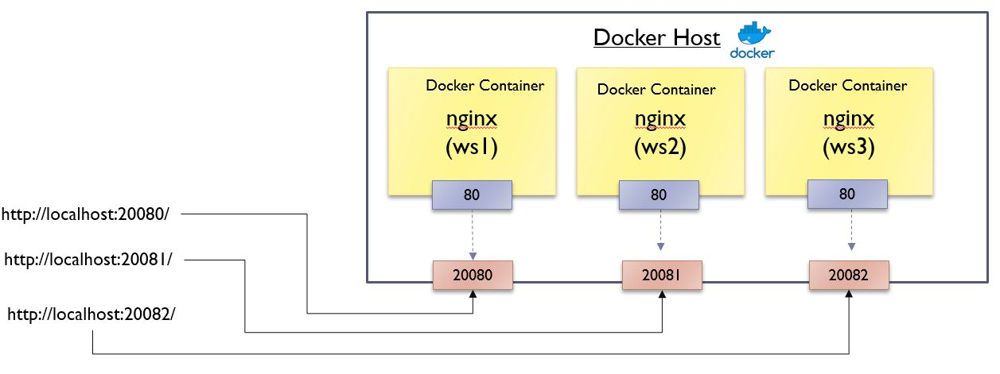

<h1>Exericse: Running three instances of nginx web server</h1>
Start three instances of nginx docker containers. 

Use the -d option runs the container in detached mode (the server will run in background).

`docker run -d -p 20080:80 --name ws1 nginx`{{execute}}

`docker run -d -p 20081:80 --name ws2 nginx`{{execute}}

Check that there are TWO running nginx containers:

`docker container ls`{{execute}}

`docker exec ws1 /bin/bash -c "echo 'This is server 1' > /usr/share/nginx/html/index.html"`{{execute}}

`docker exec ws2 /bin/bash -c "echo 'This is server 2' > /usr/share/nginx/html/index.html"`{{execute}}

Similarly, create the third web instance of the webserver  which outputs "This is server 3. Map the container port "80" to host port "20082".

Access the three instances of webservers at
<pre>http://localhost:20080/, http://localhost:20081/, http://localhost:20082/</pre>

https://[[HOST_SUBDOMAIN]]-20080-[[KATACODA_HOST]].environments.katacoda.com/

https://[[HOST_SUBDOMAIN]]-20081-[[KATACODA_HOST]].environments.katacoda.com/

https://[[HOST_SUBDOMAIN]]-20082-[[KATACODA_HOST]].environments.katacoda.com/

Stop and remove the container after completing the exercise.
<pre>docker rm –f [container_id1] [container_id2], ...</pre>
